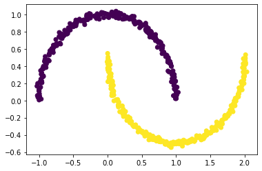
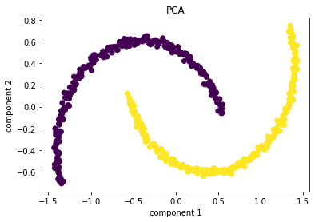
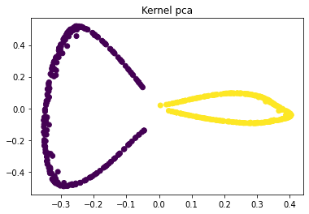

```python
import matplotlib.pyplot as plt
from sklearn.datasets import make_moons
```


```python
X,y=make_moons(n_samples=500,noise=0.02,random_state=417)
plt.scatter(X[:,0],X[:,1],c=y)
plt.show
```


    <function matplotlib.pyplot.show(close=None, block=None)>





```python
from sklearn.decomposition import PCA
pca=PCA(n_components=2)
X_pca=pca.fit_transform(X)
plt.title("PCA")
plt.scatter(X_pca[:,0],X_pca[:,1],c=y)
plt.xlabel("component 1")
plt.ylabel("component 2")
plt.show()
```





```python
#kernel pca
from sklearn.decomposition import KernelPCA
kpca=KernelPCA(kernel='rbf',gamma=15)
X_kpca=kpca.fit_transform(X)
plt.title("Kernel pca")
plt.scatter(X_kpca[:,0],X_kpca[:,1],c=y)
plt.show()
```





```python

```
